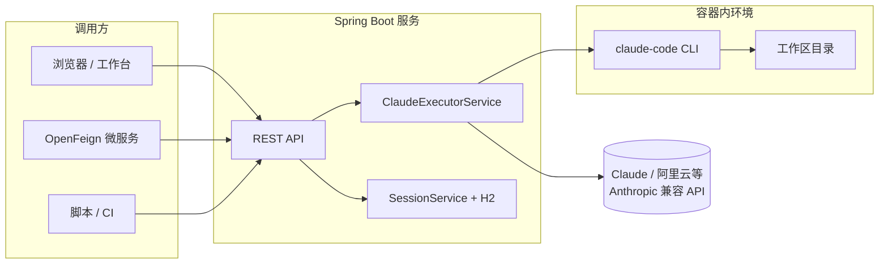

# Goodluck Claude Code Server

基于 **Spring Boot** 的 **Claude Code CLI** 网关服务：把官方 `@anthropic-ai/claude-code` 封装在 **可容器化交付** 的运行环境中，通过 **HTTP / OpenAPI** 对外提供远程调用能力，并内置 **会话与多轮对话**、项目与工作区管理。支持在配置中切换 **Anthropic 兼容的 Claude 模型** 与 **阿里云 DashScope（通义）等第三方模型端点**。

---

## 核心能力一览

| 能力 | 说明 |
|------|------|
| **Claude Code 容器化** | 基础镜像内置 Node.js、全局安装 `claude-code`，运行时挂载业务 JAR，一条命令拉起完整推理环境 |
| **远程调用** | REST API + Knife4j 文档；可被前端、脚本或其它微服务（OpenFeign）调用 |
| **会话管理** | UUID 会话；与 Claude CLI 的 `--session-id` / `--resume` 对齐；数据落 H2，可查询历史消息 |
| **模型可切换** | 通过 `claude.*` 配置 API Key、`baseUrl`、主模型/快速模型；示例含 Claude 官方兼容网关与阿里云 DashScope Anthropic 兼容地址 |

---

## 架构示意



---

## 容器化封装说明

仓库采用 **双镜像分层**，便于复用「带 Claude Code 的运行时」与「业务版本」：

1. **`DockerFileBase` → `goodluck-claude-base`**  
   - Ubuntu 22.04，内置 **JDK 8 / 17**（默认 17）、Maven、**Node.js 22**  
   - 全局安装 **`@anthropic-ai/claude-code`**（版本随 Dockerfile 固定，可改 tag 重建）  
   - 适合作为任何需要在容器里跑 `claude` 的基底镜像  

2. **`DockerFile` → `goodluck-claude-server`**  
   - `FROM` 上述 base 镜像  
   - 复制 `bootstrap.jar`、`skills/`、启动脚本，非 root 用户运行，`EXPOSE` 容器端口（与 Spring `server.port` 一致时需自行映射，见下文）  

CI 参考：`.github/workflows/docker-claude-base.yml`、`.github/workflows/docker-claude-server.yml`（构建并推送示例 tag，可按需改为私有仓库）。

**运行示例（端口以你打包时的 `application.yml` 为准，默认常为 `8081`）：**

```bash
docker pull liuroy/goodluck-claude-server:latest   # 或你的镜像名
docker run --rm -p 8081:8081 \
  -e CLAUDE_API_KEY=sk-xxx \
  -e SPRING_PROFILES_ACTIVE=docker \
  liuroy/goodluck-claude-server:latest
```

> 生产环境请通过环境变量或挂载配置注入 **API Key、workspace 路径、代理** 等，避免把密钥写进镜像层。

---

## 远程调用

- **OpenAPI / Knife4j**：启动后访问 **`http://<host>:<port>/doc.html`**（具体端口见 `server.port`）。  
- **主要 REST 前缀**（无全局 `/api` 前缀时）：`/projects`、`/sessions` 等，以 Knife4j 为准。  
- **跨服务调用**：`goodluck-claude-api` 中 `ProjectFeignClient` 的 `path = "/projects"`，URL 由 `ai-coding-claude-service.url` 配置。  

若开启登录（`goodluck.login.enabled`），需先走登录接口获取 Token，并在请求头携带（白名单路径除外，见配置中的 `whitelist`）。

---

## 会话管理

- **创建会话**：`POST /sessions`（可选 body 绑定 `projectName`）。  
- **会话列表**：`GET /sessions`。  
- **某会话在某项目下的对话历史**：`GET /sessions/messages?sessionId=&projectName=`。  
- **与代码生成联动**：`POST /projects/generate` 支持传入 **`sessionId`**；首次在该项目上使用会走 CLI 的 `--session-id`，后续同会话同项目则走 **`--resume`**，实现多轮连续对话。会话与消息摘要由 **H2**（默认文件库 `./data/claude-session`）持久化。

---

## 模型配置：Claude 与阿里云（示例）

以下均在 `claude` 配置段（可用环境变量覆盖敏感项），核心是 **`apiKey` + `baseUrl` + `model` / `fastModel`**，由底层 CLI / 运行时消费（请对照你实际使用的 claude-code 版本与环境变量命名）。

**Anthropic 兼容网关（示例形态，请替换为你的合规端点）：**

```yaml
claude:
  enableThirdModel: true
  thirdModelType: claude
  apiKey: ${CLAUDE_API_KEY}
  baseUrl: https://api.anthropic.com        # 或你的兼容 Base URL
  model: claude-opus-4-6
  fastModel: claude-opus-4-6
```

**阿里云 DashScope — Anthropic 兼容应用接口（示例，以控制台实际地址为准）：**

```yaml
claude:
  enableThirdModel: true
  thirdModelType: claude                    # 或项目内约定的其它取值，以代码为准
  apiKey: ${DASHSCOPE_API_KEY}
  baseUrl: https://dashscope.aliyuncs.com/apps/anthropic
  model: qwen3-coder-plus
  fastModel: qwen3-coder-plus
```

> **务必**使用环境变量或密钥管理注入 Key，不要提交到 Git。切换模型后若 CLI 行为异常，请查阅当前 `claude-code` 版本对自定义 `baseUrl` 的支持说明。

其它常用项：`claude.executable`（默认 `claude`）、`workspace-dir`、`timeout`、`max-concurrent-processes`、`proxy.*`。

---

## 演示动图（可选）

在下列路径放入 GIF 后，取消注释即可在 GitHub 首页展示（相对路径以仓库根为准）：

<p align="center">
  <!--  -->
  <!--  -->
</p>

更多说明见 [`docs/assets/README.md`](docs/assets/README.md)。

---

## 本地开发

**要求**：JDK 17+、Maven 3.6+；本机直接跑时还需本机安装 `claude` 或在容器中运行。

```bash
jdk17   # 若你使用别名切换到 JDK 17
mvn -pl goodluck-claude-service -am clean package -DskipTests
java -jar goodluck-claude-service/target/bootstrap.jar
```

或使用 `mvn spring-boot:run`（在 `goodluck-claude-service` 模块目录下）。

---

## 健康与监控

- **Actuator**：`/actuator/health`、`/actuator/prometheus`（若已开放）  
- 应用打印的文档与自检地址以启动日志为准（如 `/doc.html`、部分环境下列出 `/api/health`）。

---

## 模块结构（精简）

```
goodluck-claude-server/          # 父 POM
├── goodluck-claude-api/         # Feign、DTO、对外契约
├── goodluck-claude-service/     # Spring Boot 主工程、Controller、JGit、会话持久化
├── DockerFileBase               # Claude Code 基础镜像
├── DockerFile                   # 服务镜像
└── run/                         # 容器内 run-java 脚本
```

---

## 许可证与支持

- **许可证**：若仓库根目录包含 `LICENSE` 文件则以其为准。  
- **问题排查**：查看服务日志、Knife4j 返回体、以及容器内 `claude` 是否在 `PATH` 中可用。

---

**一句话**：本仓库把 **Claude Code** 装进 **标准容器**，用 **Spring Boot** 提供 **可远程调用的 API** 与 **可查询的会话历史**，并通过配置在 **Claude 系模型** 与 **阿里云等兼容端点** 之间切换。
